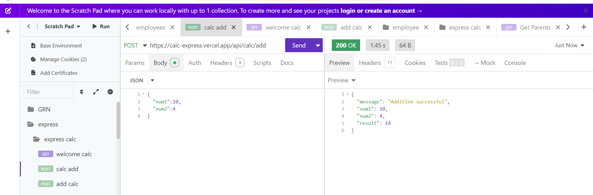

# 🧮 Simple Calculator API

A beginner-friendly REST API built with **Node.js** and **Express.js** that performs basic arithmetic operations:

- ➕ Addition  
- ➖ Subtraction  
- ✖️ Multiplication  
- ➗ Division

This project is perfect for **classroom learning**, with a clean, modular structure that's easy to understand and extend.

---

## 🚀 Features

- Perform calculations using **HTTP POST** requests
- Organized routes using Express Router
- Handles division-by-zero errors
- Designed following RESTful API conventions
- Ideal starter project for full-stack development

---

## 🗂️ Project Folder Structure

```

calc-api/
├── app.js             # Main application entry
├── routes/
│   └── calc.js        # Calculator route logic
├── package.json       # Project config and scripts
└── node\_modules/      # Installed dependencies

````

---


### ✅ Step 2: Initialize Node.js

```bash
npm init -y
```


### ✅ Step 3: Create Project Files

* `app.js`
* `routes/calc.js`

Use the code you have (see below 👇) to populate those files.

---

## 📝 Code Files

### 📄 `app.js`

```js
const express = require('express');
const cors = require('cors');
const app = express();

// Middleware to parse JSON bodies
app.use(express.json());

// Enable CORS
app.use(cors());

// Import calculator routes
const calc = require('./routes/calc');
app.use('/api/calc', calc);

// Set your port
const PORT = process.env.PORT || 3000;

app.listen(PORT, () => {
    console.log(`Server running on port ${PORT}`);
});
```

---

### 📄 `routes/calc.js`

```js
const express = require('express');
const router = express.Router();

// Root route
router.get('/', (req, res) => {
    res.json({
        message: 'Welcome to the Calculator API!',
        instructions: 'Use POST requests to /add, /subtract, /multiply, or /divide'
    });
});

// Add
router.post('/add', (req, res) => {
    const { num1, num2 } = req.body;
    const sum = num1 + num2;
    res.json({ message: "Addition successful", num1, num2, result: sum });
});

// Subtract
router.post('/subtract', (req, res) => {
    const { num1, num2 } = req.body;
    const difference = num1 - num2;
    res.json({ message: "Subtraction successful", num1, num2, result: difference });
});

// Multiply
router.post('/multiply', (req, res) => {
    const { num1, num2 } = req.body;
    const product = num1 * num2;
    res.json({ message: "Multiplication successful", num1, num2, result: product });
});

// Divide
router.post('/divide', (req, res) => {
    const { num1, num2 } = req.body;
    if (num2 === 0) {
        return res.status(400).json({ error: "Division by zero is not allowed" });
    }
    const quotient = num1 / num2;
    res.json({ message: "Division successful", num1, num2, result: quotient });
});

module.exports = router;
```

---

## 🚦 Run the Server

You can run the server using:

```bash
node app.js
```

Or set up an npm script for ease:

### 📄 In `package.json`, add:

```json
"scripts": {
  "start": "node app.js"
}
```

Then run:

```bash
npm start
```

---

## 🧪 Testing the API

You can test the API using tools like **Insomnia** or **Postman**.

### ✏️ Example POST request to `/api/calc/add`

* **Method:** POST
* **URL:** `http://localhost:3000/api/calc/add`
* **Body (JSON):**

```json
{
  "num1": 10,
  "num2": 5
}
```


---

## ✅ Expected Response

```json
{
  "message": "Addition successful",
  "num1": 10,
  "num2": 5,
  "result": 15
}
```


---

## 💡 Suggested Challenges for Students

* Add input validation: check if `num1` and `num2` are actually numbers
* Add support for GET requests with query params
* Expand the API to include modulus (%) or exponentiation
* Add a `/history` endpoint that logs previous calculations (in memory)

